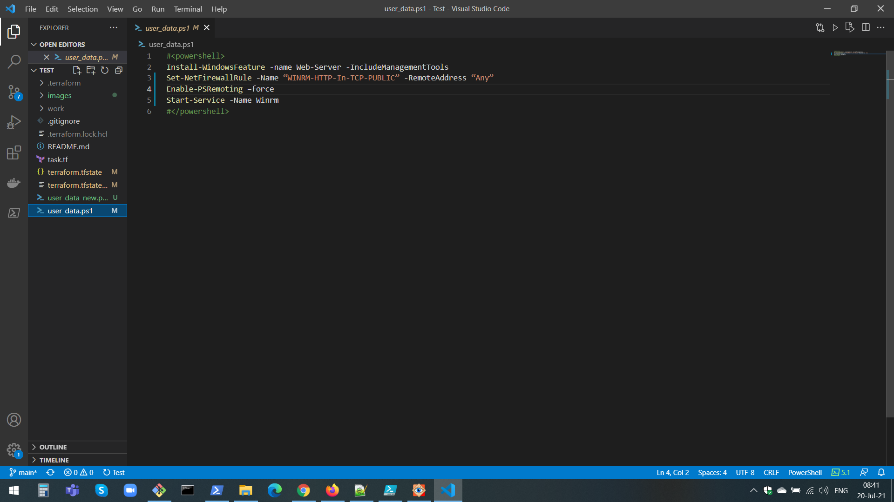
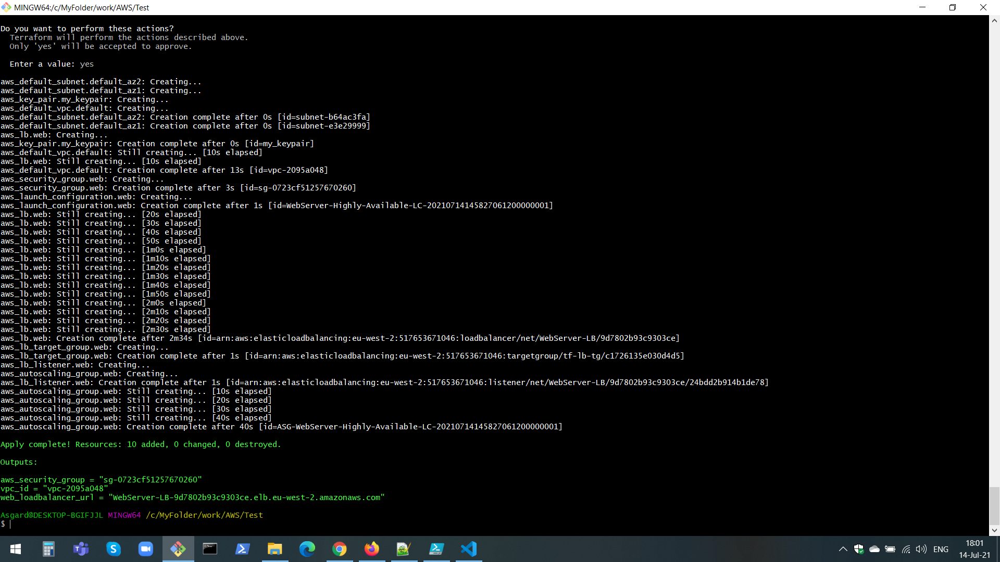
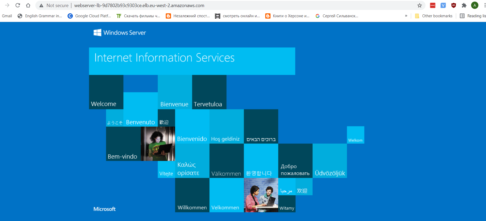
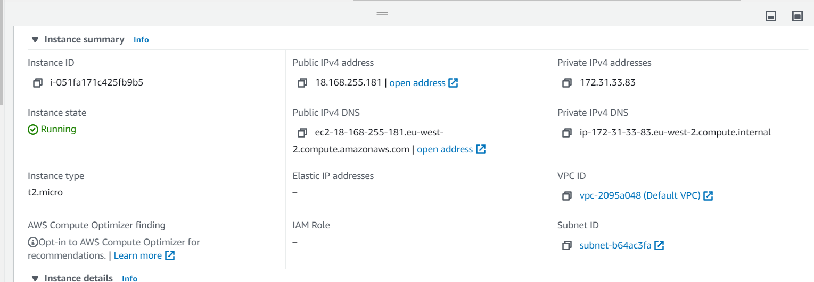
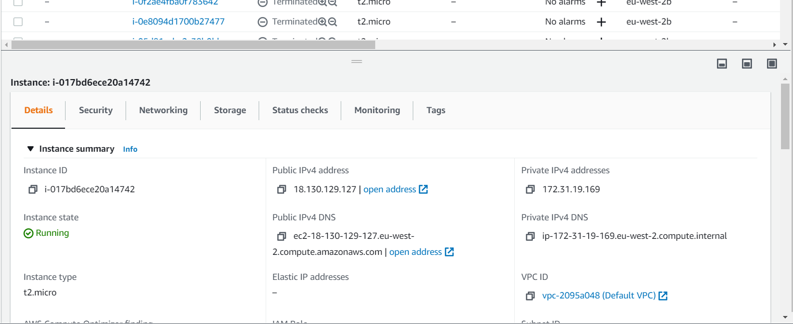
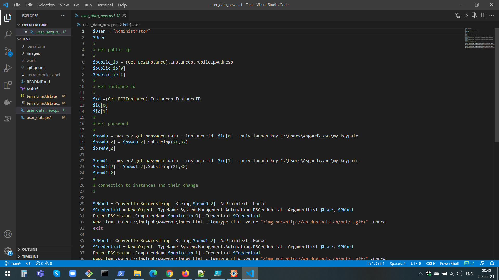
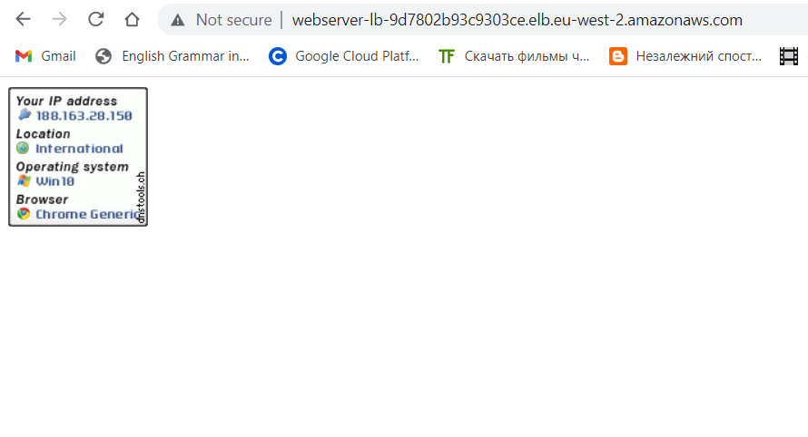

# nlb-aws-terraform

In our task, we deploy the ***network load balancer*** using *terraform* and *powershell*.

In terraform we use the following resources:

resource "aws_default_vpc"

https://registry.terraform.io/providers/hashicorp/aws/latest/docs/resources/default_vpc

resource "aws_security_group"

https://registry.terraform.io/providers/hashicorp/aws/latest/docs/resources/security_group

resource "aws_launch_configuration"

https://registry.terraform.io/providers/hashicorp/aws/latest/docs/resources/launch_configuration

resource "aws_autoscaling_group"

https://registry.terraform.io/providers/hashicorp/aws/latest/docs/resources/autoscaling_group

resource "aws_lb"

https://registry.terraform.io/providers/hashicorp/aws/latest/docs/resources/lb

resource "aws_lb_listener"

https://registry.terraform.io/providers/hashicorp/aws/latest/docs/resources/lb_listener

resource "aws_lb_target_group"

https://registry.terraform.io/providers/hashicorp/aws/latest/docs/resources/lb_target_group

resource "aws_default_subnet"

https://registry.terraform.io/providers/hashicorp/aws/latest/docs/resources/default_subnet

# Commands:

terraform init

terraform plan

terraform aplly

To deploy our webserver we use the Powershell script: ***user_data.ps1***

After **terraform aplly:**

http://webserver-lb-9d7802b93c9303ce.elb.eu-west-2.amazonaws.com/

# Our instances:

We  run the script **user_data_new**  for change our web:

http://webserver-lb-9d7802b93c9303ce.elb.eu-west-2.amazonaws.com/

# The IP of my computer:

